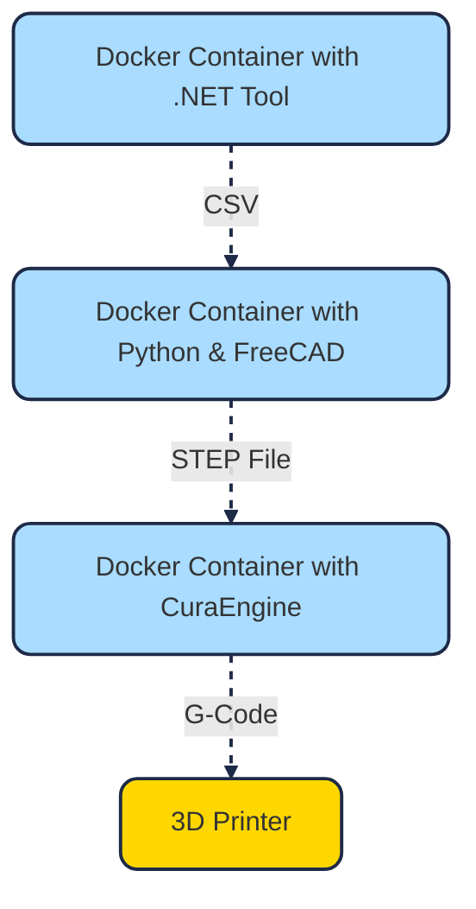

```mermaid
graph TD
    A[Docker Container with .NET Tool] -->|CSV| B[Docker Container with Python & FreeCAD]
    B -->|STEP File| C[Docker Container with CuraEngine]
    C -->|G-Code| D[3D Printer]
    

    style A fill:#A9DCFF,stroke:#1E2A47,stroke-width:2px,rx:10px,ry:10px
    style B fill:#A9DCFF,stroke:#1E2A47,stroke-width:2px,rx:10px,ry:10px
    style C fill:#A9DCFF,stroke:#1E2A47,stroke-width:2px,rx:10px,ry:10px
    style D fill:#FFD700,stroke:#1E2A47,stroke-width:2px,rx:10px,ry:10px
    
    linkStyle 0 stroke:#1E2A47,stroke-width:2px,stroke-dasharray: 5 5
    linkStyle 1 stroke:#1E2A47,stroke-width:2px,stroke-dasharray: 5 5
    linkStyle 2 stroke:#1E2A47,stroke-width:2px,stroke-dasharray: 5 5
```